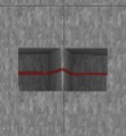

# Documentation

- - -

## Index

*   [Description](#description)
*   [Code](#code)
*   [Data Types](#data-types)
*   [Data](#data)
*   [Generated Circuit](#generated-circuit)
*   [Contribute](#contribute)

- - -

## Description

[This online tool](https://sp4cebarsystems.github.io/SC-Bank-Generator/) allows easy programming and data generation for [memory bank](https://survivalcraftgame.fandom.com/wiki/Memory_Bank) systems in [Survivalcraft](https://en.wikipedia.org/wiki/Survivalcraft). It supports three different use cases: ROM, Selector ROM, and FSM.

*   **ROM: [Read only Memory](https://en.wikipedia.org/wiki/Read-only_memory)**  
    for any input value coming in, one programmed output value is coming out. This can be used to make calculators or displays. This is the simplest, and likely most common, of the three.
*   **Selector ROM:**  
    An array of ROMs that all have the same input. Each ROM will respond differently to the input. For example, it may be set to activate only when its input is equal to its location number, thus creating a selector. This has many uses in displays, ROMs and [RAMs](https://en.wikipedia.org/wiki/Random-access_memory). This online tool will even generate some if your ROMs have too many inputs for a single Memory Bank
*   **FSM: [Finite State Machine](https://en.wikipedia.org/wiki/Finite-state_machine)**  
    A memory bank with its output connected to its input will behave like an FSM. An FSM has a fixed number of states and can choose to go to any other state depending on its current state and some external inputs. It can be used to store and step through its states. I found it most useful for handling game loops.

- - -

## Code

Within the code field you can write a [javascript](https://developer.mozilla.org/en-US/docs/Web/JavaScript) function. When you press the run button, the function will be evaluated for every input of your memory bank, the output of the function will be saved as memory bank data. It will be encoded in [data types](#types) and split over [digits](#data).

### Relevant Javascript Documentation

*   [Javascript](https://developer.mozilla.org/en-US/docs/Web/JavaScript/Guide/Introduction)
*   [Basic Calculating](https://developer.mozilla.org/en-US/docs/Learn_web_development/Core/Scripting/Math)
*   [Math Functions](https://developer.mozilla.org/en-US/docs/Web/JavaScript/Reference/Global_Objects/Math)

- - -

## Data-Types

Each value may be split up into multiple smaller parameters of specific sizes in bits. Allowing you to treat them separately. You can use the "input types" and "output types" fields to set the amount of parameters and their types and sizes. This can be done by typing a numbers (sizes in bits) separated by commas, each number is a parameter Instead of a number you may type a datatype, the code supports the following types:

### Unsigned Integer Types

An unsigned integer is a whole number that can **not** be negative.

#### Format

On this online tool it is formatted as "U\_INT\_\[n\]" (without the quotes) (where "\[n\]" is any number representing the size in bits)  

#### Examples

| Type | Bits | Range |
| --- | --- | --- |
| U\_INT\_1 | 1-bit | 0 to 1 |
| U\_INT\_2 | 2-bit | 0 to 3 |
| U\_INT\_3 | 3-bit | 0 to 7 |
| U\_INT\_4 | 4-bit | 0 to 15 |
| U\_INT\_5 | 5-bit | 0 to 31 |
| U\_INT\_6 | 6-bit | 0 to 63 |
| U\_INT\_7 | 7-bit | 0 to 127 |
| U\_INT\_8 | 8-bit | 0 to 255 |
| U\_INT\_16 | 16-bit | 0 to 65,535 |
| U\_INT\_32 | 32-bit | 0 to 4,294,967,295 |
| U\_INT\_64 | 64-bit | 0 to 18,446,744,073,709,551,615 |

#### Other forms

| Type | Equivalent To | Bits | Range |
| --- | --- | --- | --- |
| \[n\] | U\_INT\_\[n\] | n bits | 0 to (2ⁿ - 1) |
| BYTE | U\_INT\_8 | 8-bit | 0 to 255 |
| NIBBLE | U\_INT\_4 | 4-bit | 0 to 15 |
| BIT | U\_INT\_1 | 1-bit | 0 to 1 |
| FLAG | U\_INT\_1 | 1-bit | 0 to 1 |
| BOOLEAN | U\_INT\_1 | 1-bit | 0 to 1 |
| BOOL | U\_INT\_1 | 1-bit | 0 to 1 |

### (Signed) Integer Types

A signed integer (aka integer) is a whole number that can be negative.

#### Two's Complement

This tool uses [two's complement](https://en.wikipedia.org/wiki/Two%27s_complement) to represent negative numbers in binary, here the most significant bit has been negated. For example a four bit number's bits in 2s complement would be valued: 1, 2, 4, -8 instead of 1, 2, 4, 8.

#### Format

on this online tool it is formatted as "INT\_\[n\]" (without the quotes) (where "\[n\]" is any number representing the size in bits)  

#### Examples

| Type | Bits | Range |
| --- | --- | --- |
| INT\_1 | 1-bit | \-1 to 0 |
| INT\_2 | 2-bit | \-2 to 1 |
| INT\_3 | 3-bit | \-4 to 3 |
| INT\_4 | 4-bit | \-8 to 7 |
| INT\_5 | 5-bit | \-16 to 15 |
| INT\_6 | 6-bit | \-32 to 31 |
| INT\_7 | 7-bit | \-64 to 63 |
| INT\_8 | 8-bit | \-128 to 127 |
| INT\_16 | 16-bit | \-32,768 to 32,767 |
| INT\_32 | 32-bit | \-2,147,483,648 to 2,147,483,647 |
| INT\_64 | 64-bit | \-9,223,372,036,854,775,808 to 9,223,372,036,854,775,807 |

### Floating Point Number Types

Currently unsupported

### Optional Parameters

#### Offset

Currently unsupported

- - -

## Data

Whenever memory bank data is generated you may need more than one memory bank to contain it, these are structured by three metrics:

1.  **digit:** Whenever you need numbers larger than 15 (aka "F") to be output from your memory bank, you will need more digits.
2.  **input:** Whenever you need numbers larger than 255 (aka "FF") to be input into your memory bank, you will need more banks to handle the higher ranges
3.  **location:** Whenever you are making a selector ROM system you will need a ROM for each physical location
Using this makes your ROM a selector ROM (a therm I made up but will be using throughout this site)

When designing a system using this tool consider how many bits you really need as each [SurvivalCraft memory bank](https://survivalcraftgame.fandom.com/wiki/Memory_Bank) has an 8-bit address input and a 4-bit output. The amount of memory banks required is:  
```
banks = Locations × floor ( OutputSize 4 ) × 2 ^ max ( 0 , InputSize - 8 )
```
This calculation should be shown automatically each time data is generated.  
As you can see the input size scales exponentially: for one 4-bit-output-and-16-bit-input system you need 256 banks: 
```
(1) × floor ( (4) 4 ) × 2 ^ max ( 0 , (16) - 8 ) = 256
```

- - -

## Generated-Circuit

A circuit is generated alongside the data. The image is made up of multiple screenshots from SurvivalCraft stitched together and may cause some slight graphical artifacts as seen below. The circuit part shown in that image may be treated as a single trench with a wire in it.



- - -

## Contribute

If you have an idea for a feature or bug fix for this site, you can [fork](https://docs.github.com/en/pull-requests/collaborating-with-pull-requests/working-with-forks/fork-a-repo) it, [develop](https://developer.mozilla.org/en-US/docs/Web/JavaScript/Guide/Introduction) it and make a [pull request](https://docs.github.com/en/pull-requests/collaborating-with-pull-requests/proposing-changes-to-your-work-with-pull-requests/creating-a-pull-request-from-a-fork). If I see it, it works, and I like it I will add it to this project.

[Report Issue](https://github.com/SP4CEBARsystems/SC-Bank-Generator/issues) [Contribute](https://github.com/SP4CEBARsystems/SC-Bank-Generator)
